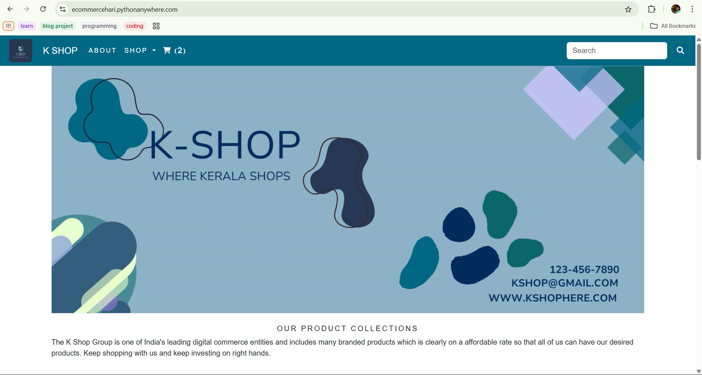
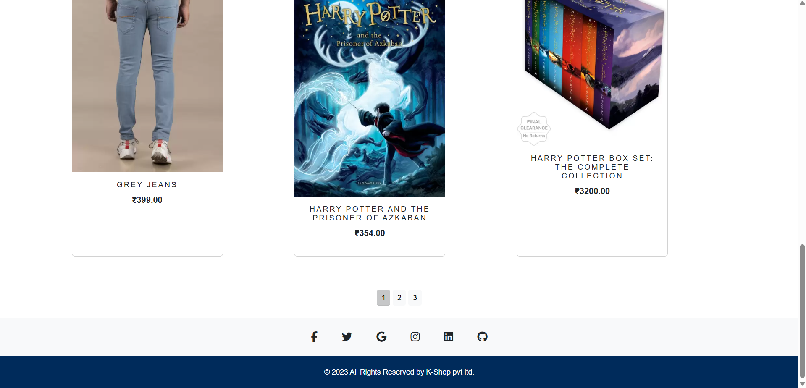
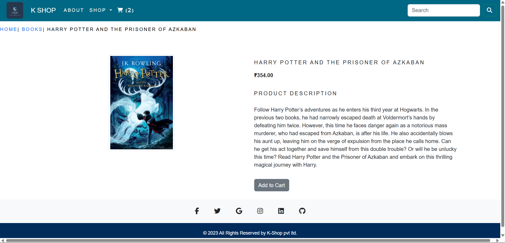
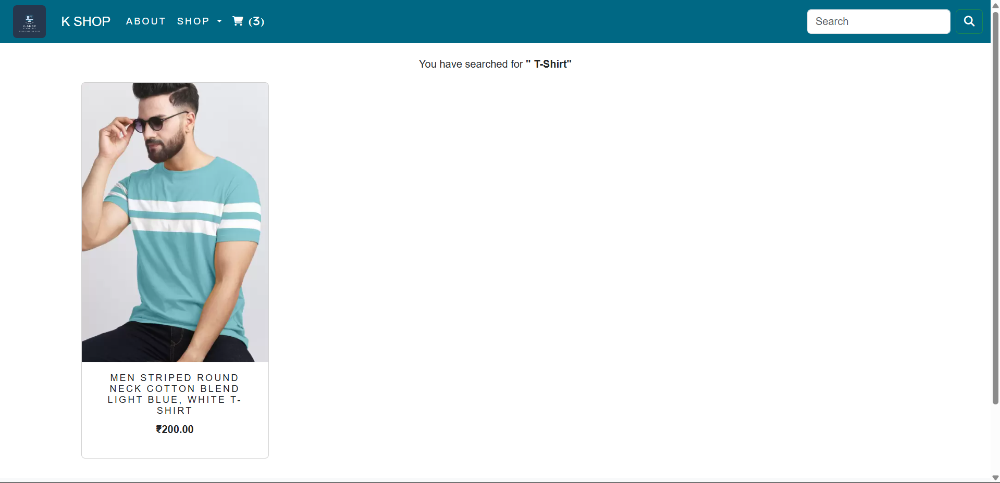
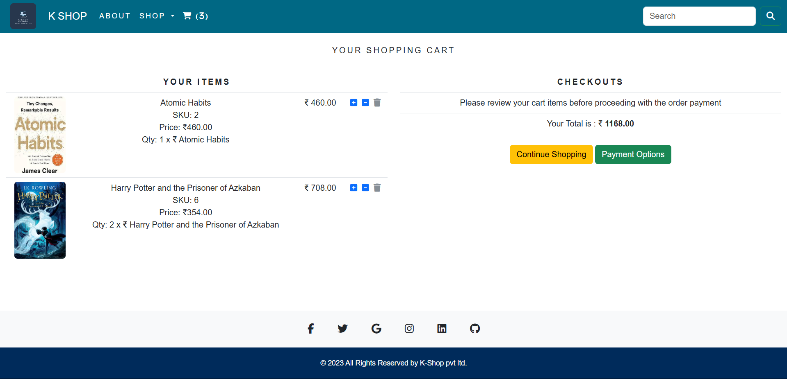

# 🛒 Django Ecommerce Project

A simple ecommerce website built with Django, featuring product categories, search, cart management, and checkout.

## 🚀 Features

- Category-wise product listing
- Product detail pages
- Search functionality
- Add to cart, remove from cart
- Checkout page
- Admin dashboard for product management
- Slug-based SEO URLs
- Pagination support

## 🔧 Tech Stack

- Backend: Django, Python
- Frontend: HTML, CSS, Bootstrap
- Database: SQLite

## ⚙️ Installation Instructions

Follow these steps to set up the project on your local machine:

### 1. Clone the repository

```bash
git clone https://github.com/harikrishnanap/ecommerce.git
cd ecommerce
```
### 2. Create and activate a virtual environment
```bash
python -m venv venv

# For Windows:
venv\Scripts\activate

# For macOS/Linux:
source venv/bin/activate
```
### 3. Install Django and other dependencies
```bash
pip install -r requirements.txt
```
### 4. Apply database migrations
```bash
python manage.py makemigrations
```

### 5. Run the development server
```bash
python manage.py runserver
```

Visit: http://127.0.0.1:8000/

## 🚀 Live Demo

🟢 [ecommerce live here](https://ecommercehari.pythonanywhere.com/)

## 📸 Screenshots

### 🏠 Home Page




### Product Detail Page


### Category Page


### Search Page


### Cart Page


## 📁 Project Structure

```bash
ecommerce/
├── ecommerce/          # Django project folder (settings.py, urls.py, wsgi.py)
│   ├── __init__.py
│   ├── asgi.py
│   ├── settings.py
│   ├── urls.py
│   └── wsgi.py
│
├── shop/               # Django app for handling ecommerce logic
│   ├── migrations/
│   ├── __init__.py
│   ├── admin.py
│   ├── apps.py
│   ├── models.py
│   ├── tests.py
│   ├── views.py
│   └── urls.py
│
├── static/             # Static files (CSS, JS, images)
│   └── style.css
│
├── templates/          # HTML templates
│   ├── base.html
│   └── shop/
│       ├── index.html
│       ├── category.html
│       └── product.html
│
├── db.sqlite3          # SQLite DB file
├── manage.py           # Django's CLI utility
```

## 🙋‍♂️ Author

[Harikrishnan A P](https://github.com/harikrishnanap)
